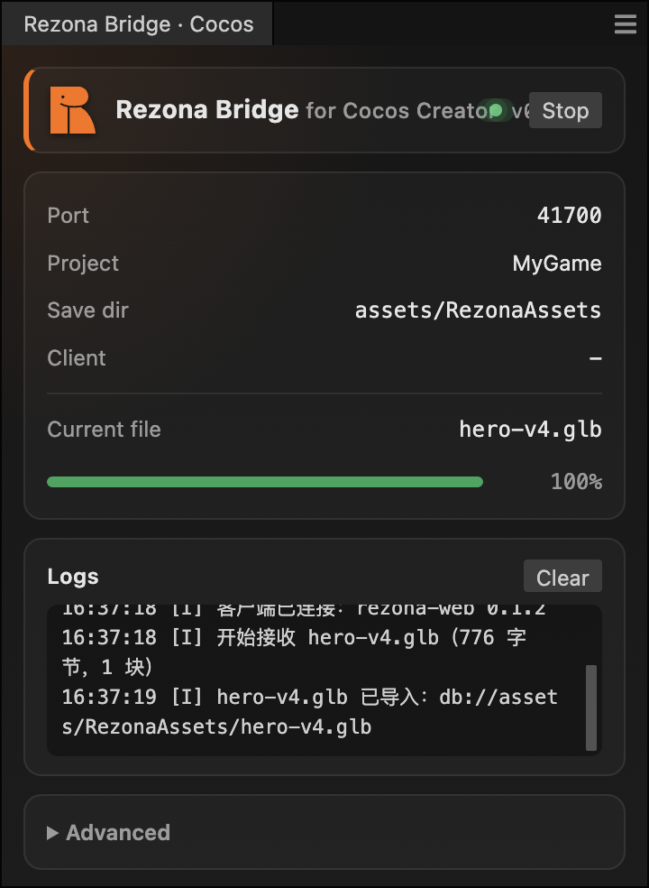

# 安装 Rezona Bridge · Cocos Creator

适用：Cocos Creator **3.8.5 及以上**，macOS 与 Windows。扩展只监听 `127.0.0.1`、只接受白名单来源，不留任何自启动钩子；卸载即干净。

## 安装步骤

1. 从 [Releases](https://github.com/rezona-ai/rezonalab-engine-bridge/releases) 下载 `rezona-bridge-cocos-<版本>.zip`（不要解压）。
2. 打开你的 Cocos 工程，菜单 **扩展 → 扩展管理器**（Extension → Extension Manager）。
3. 切到「项目」或「全局」页签，点右上角 **导入扩展（Import）**，选中刚下载的 zip。

   
   <!-- TODO：首个正式版发布时补截图 -->

4. 列表里出现 **Rezona Bridge**，把右侧开关拨到启用。

   
   <!-- TODO：首个正式版发布时补截图 -->

5. 菜单 **扩展 → Rezona Bridge** 打开面板，看到「监听中 · 端口 41700」即安装完成。

   
   <!-- TODO：首个正式版发布时补截图 -->

6. 回到 Rezona Lab 工作台，顶栏「Engine Bridge」拨开 **Cocos** 开关；Chrome 会弹一次「连接本地网络设备」询问，点允许。徽标变成「已连接 · <工程名>」后，画布卡片上的「发送至 → Cocos」就能用了。

编辑器启动即自动监听（面板里可关掉「自动启动」）；升级时重新导入新 zip 覆盖即可。

## 面板字段

| 字段 | 含义 |
|---|---|
| 状态 | `已停止` / `监听中` / `传输中` 三态 |
| 端口 | 当前占用的端口；同机第二个 Cocos 工程会自动落到 41701 |
| 工程 | 当前工程名与 8 位工程 id（网页端多工程选择时按这个区分） |
| 当前文件 | 正在接收或导入的文件名 |
| 进度 | 接收百分比 → 导入中 → 已导入 |
| 日志 | 最近 200 行；「拒绝来源 …」一类安全事件也在这里 |
| 停止 / 启动 | 手动释放或重新占用端口；停止状态会被记住 |
| 高级 → 额外允许来源 | 见下文 |

资产落在工程的 `assets/RezonaAssets/` 下：glb / 图片 / 音频直接落文件，sprite 的 png 与 json 在同一个子目录；3D 资产会实例化到当前场景并被选中。

## 「高级」：Origin 允许列表

插件只接受来自以下网页来源的连接（浏览器保证页面脚本改不了 Origin 头，这就是「随机网页写你工程」的唯一也是足够的闸）：

```
https://lab.rezona.ai
https://stalab.rezona.ai
https://devlab.rezona.ai
```

如果你在本机跑 game-web 前端调试，把它的地址填进「高级 → 额外允许来源」，一行一个，例如 `http://localhost:3000`。填完立即生效，不用重启编辑器。不要填通配符，也不要把别人的站点填进来。

## 常见故障

### 1. 浏览器权限弹窗被拒绝了 / 顶栏一直「未找到引擎」

Chrome 142 及以上把 `ws://127.0.0.1` 归入「本地网络访问」，首次连接会弹「<站点> 想要连接本地网络上的设备」。点了「拒绝」之后不会再弹，网页端会显示「未能连接本地插件，可能是权限被拒绝」。

恢复方法：点地址栏左侧的站点信息图标 →「网站设置」→ 找到「本地网络访问」（Local network access）改为「允许」，或直接「重置权限」，然后刷新页面再拨开开关。也可以在 `chrome://settings/content/localNetworkAccess` 里统一处理。

其它浏览器：Edge 同 Chrome；Firefox 目前没有此弹窗；**Safari 不支持**。

### 2. 端口全占（41700–41719）

面板显示「端口 41700–41719 均被占用」时，说明这段 20 个端口都被别的进程拿着。多数是残留的 Cocos 进程或之前没关掉的假引擎（`npm run dev:fake-engine`）。

排查：macOS `lsof -nP -iTCP:41700-41719 -sTCP:LISTEN`，Windows `netstat -ano | findstr 417`。结束占用进程后在面板点「启动」即可，无需重启编辑器。

### 3. 工程未打开 / 资产库未刷新

网页端胶囊提示「导入失败」、面板日志有 `IMPORT_TIMEOUT` 或 `PROJECT_NOT_OPEN`：文件已经落在 `assets/RezonaAssets/`，但资产库 15 秒内没登记出来。

- 确认扩展是在**工程内**启用的，而不是只在全局页签里启用却没开工程。
- 在资源管理器里对 `RezonaAssets` 目录右键「刷新」，资产会补登记；再发一次即可正常。
- 3D 资产要实例化到场景，需要当前有打开的场景；没打开场景时文件仍会导入，只是不会出现场景节点。

## 卸载

扩展管理器里找到 Rezona Bridge → 移除。已导入的资产是普通工程文件，留着或在引擎里删除都可以；没有任何服务端状态需要清理。
