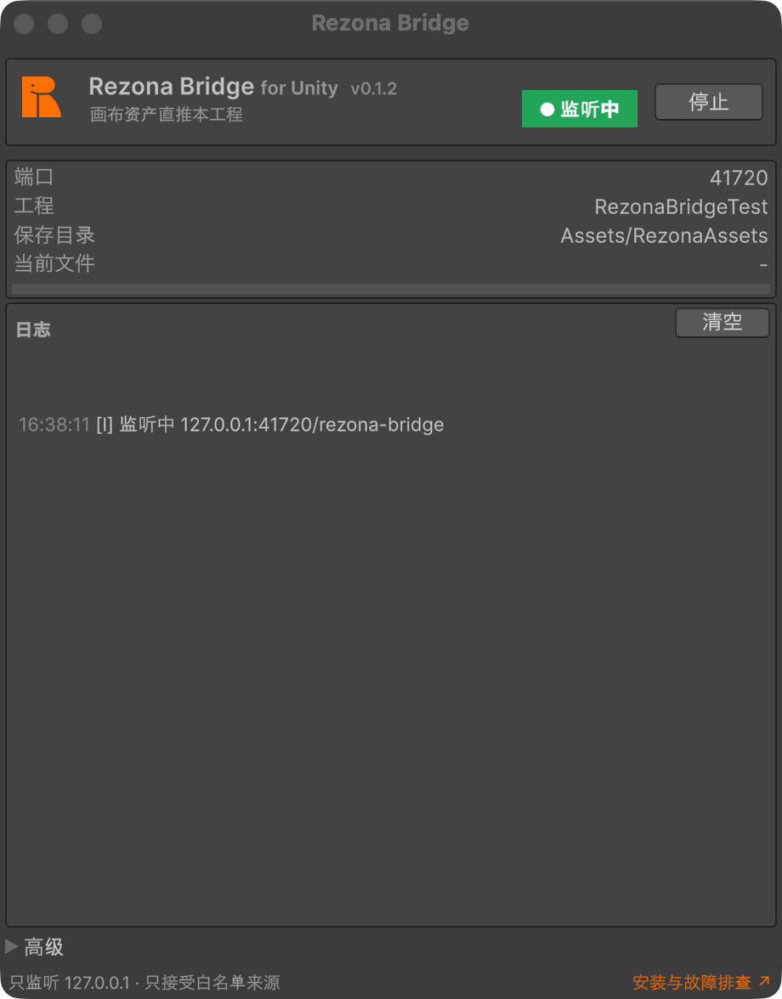

# 安装 Rezona Bridge · Unity

适用：Unity **2021.3 LTS 及以上**（推荐 2022.3 LTS），URP 与内置渲染管线均可。包只含 Editor 程序集，不会进打包产物；只监听 `127.0.0.1`、只接受白名单来源。

## 安装步骤

1. 打开 Unity 工程，菜单 **Window → Package Manager**。
2. 左上角 **＋ → Add package from git URL…**，粘贴：

   ```
   https://github.com/rezona-ai/rezonalab-engine-bridge.git?path=packages/unity#v0.1.3
   ```

   Package Manager 解析要几十秒；装好后列表里显示 **Rezona Bridge for Unity**。

3. 等待解析完成，列表里出现 **Rezona Bridge**（`com.rezonalab.engine-bridge`）。
4. 菜单 **Tools → Rezona Bridge** 打开窗口，看到「监听中 · 端口 41720」即安装完成。

   

5. 要导入 glb 需要 **glTFast**。窗口检测到缺包时会出黄条「需要 glTFast」并给一个「添加 glTFast」按钮，点它相当于在 Package Manager 里添加 `com.unity.cloud.gltfast`。

   黄条只在第一次收到 glb 且检测不到 glTFast 时出现，之后自动消失。

6. 回到 Rezona Lab 工作台，顶栏「Engine Bridge」拨开 **Unity** 开关；Chrome 会弹一次「连接本地网络设备」询问，点允许。徽标「已连接 · <工程名>」后即可在卡片上「发送至 → Unity」。

升级：把 git URL 末尾的 tag 换成新版本号 再添加一次即可覆盖。改脚本触发域重载时服务端会自动重建，端口不变。

## 窗口字段

| 字段 | 含义 |
|---|---|
| 状态 | `已停止` / `监听中` / `传输中` |
| 端口 | 当前占用端口；同机第二个 Unity 工程自动落到 41721 |
| 工程 | 工程目录名与 8 位工程 id |
| 当前文件 / 进度 | 正在接收或导入的文件与进度条 |
| 日志 | 最近 200 行 |
| 停止 / 启动 | 手动释放或重新占用端口；记在 `EditorPrefs["RezonaBridge.AutoStart"]` |
| 高级 → 额外允许来源 | 见下文 |

资产落在 `Assets/RezonaAssets/`：glb 经 glTFast 导入并实例化到当前场景、原点位置、被选中；图片 / 音频只导入；sprite 解压到 `Assets/RezonaAssets/<名字>/`。

## 「高级」：Origin 允许列表

默认只接受这三个网页来源：

```
https://lab.rezona.ai
https://stalab.rezona.ai
https://devlab.rezona.ai
```

本机调试 game-web 时，在「高级 → 额外允许来源」加一行 `http://localhost:3000`。立即生效。

## 常见故障

### 1. 浏览器权限弹窗被拒绝了 / 顶栏一直「未找到引擎」

Chrome 142 及以上首次连 `ws://127.0.0.1` 会弹「<站点> 想要连接本地网络上的设备」；拒绝后不再弹，网页显示「未能连接本地插件，可能是权限被拒绝」。

恢复：地址栏站点信息图标 →「网站设置」→「本地网络访问」改「允许」或「重置权限」→ 刷新后重新拨开开关；也可到 `chrome://settings/content/localNetworkAccess`。Edge 同理；**Safari 不支持**。

### 2. 端口全占（41720–41739）

窗口显示「端口 41720–41739 均被占用」：20 个端口全被别的进程拿着，多半是没退干净的 Unity 进程或别的本地服务。

排查：macOS `lsof -nP -iTCP:41720-41739 -sTCP:LISTEN`，Windows `netstat -ano | findstr 417`。结束占用进程后点「启动」。

### 3. glTFast 缺失

发送 glb 时胶囊「导入失败」，窗口黄条「需要 glTFast」：包里不带 glTFast，需要你的工程自己装。

- 点黄条上的「添加 glTFast」，等 Package Manager 装完 `com.unity.cloud.gltfast`（会触发一次域重载），再重发。
- 也可手动 Package Manager → 按名称添加 `com.unity.cloud.gltfast`。
- 装完材质是粉色：URP 工程需要 glTFast 的 URP shader 变体，在 Package Manager 里 glTFast 的 Samples 或 Project Settings → Graphics 里把对应 shader 加进 Always Included Shaders。

## 卸载

Package Manager 里选中 Rezona Bridge → Remove。已导入资产是普通工程文件；没有任何服务端状态需要清理。
